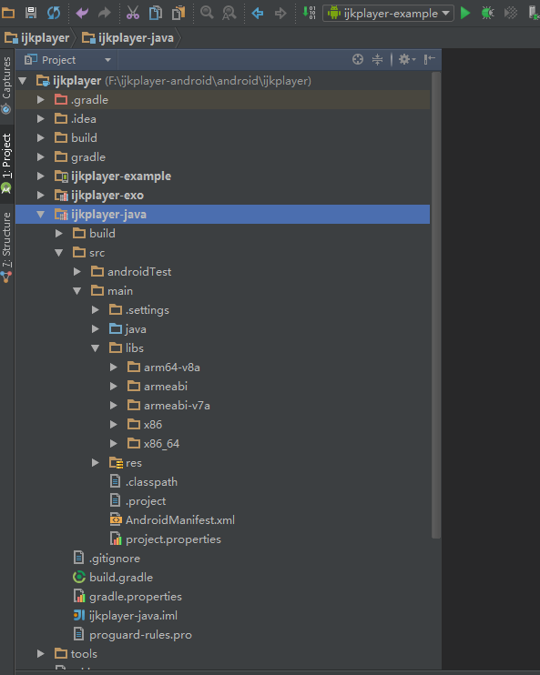

# ijkplayer-demo

  在该 https://github.com/Dawish/ijkplayer-android-demo  工程上修改了一些依赖,
  并且增加了对https的支持。

 基于ijkplayer 0.5.1最新源代码，支持armv5、armv7a、x86架构32位和64位的设备，在ubuntu环境下编译，导入Android Studio，去掉编译时使用到的代码，只保留需要用到的代码，对项目封装，这样更方便集成到我们的开发项目中去。
 
 下面是精简封装后的目录结构图:
 
 

#[APK下载](https://raw.githubusercontent.com/l123456789jy/ijkplayer/master/ijkplayer-example-all32-debug.apk)
  
